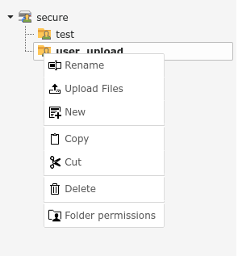

.. ==================================================
.. FOR YOUR INFORMATION
.. --------------------------------------------------
.. -*- coding: utf-8 -*- with BOM.

.. include:: ../Includes.txt

What does it do?
================

This extension (fal_securedownload) aims to be a general solution to secure your assets.

When you storage is marked as non-public all links to files from that storage are replaced (also for processed files).

The permissions for assets can be set on folder/file bases by setting access to fe_groups in the file module.

There is also a plugin to show your files as a tree on your website.

   **Image 1:** Set FE permissions for folder

**Features**

- Restrict FE access on folder level
- Restrict FE access on file level
- Let editor set permissions in file list
- Force download for all files (for protected file storages)
- Force download for specific file extensions (for protected file storages)
- Keep track of requested downloads (count downloads per user and file)
